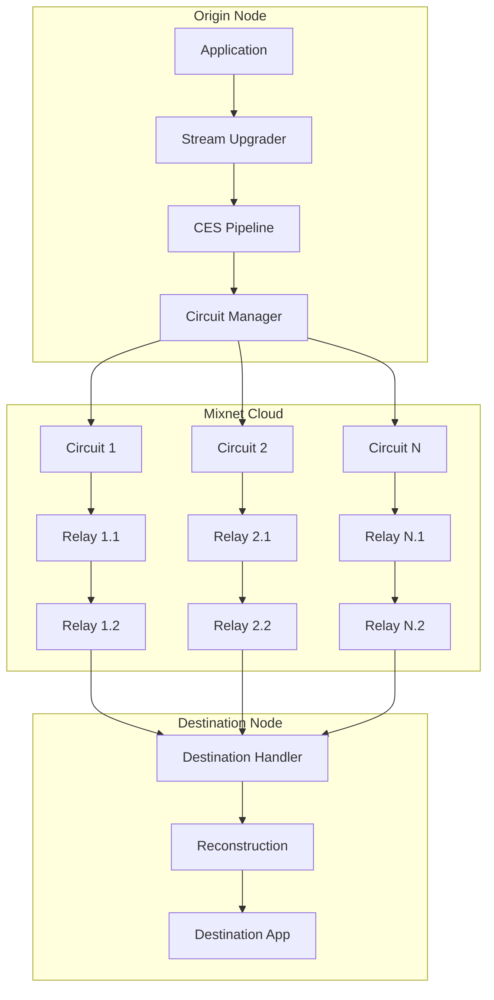

# Lib-Mix: Metadata-Private Communication for libp2p

Lib-Mix is a high-performance, sharded, configurable-hop mixnet protocol for libp2p that provides metadata-private communication at near-wire speeds.

## Overview

Lib-Mix addresses the fundamental trade-off between privacy and performance in decentralized applications. By using multi-path sharding and configurable onion routing, it enables metadata-blind communication without the massive latency overhead typical of traditional mixnets.

### Key Features

- **Transport Agnostic**: Works over any libp2p transport (QUIC, TCP, WebRTC).
- **Multi-Path Sharding**: Data is split into multiple shards sent over independent circuits, improving throughput and resilience.
- **Configurable Onion Routing**: Support for 1-10 hops, allowing developers to tune the privacy-performance trade-off.
- **Erasure Coding**: Uses Reed-Solomon coding to allow reconstruction even if some shards or circuits fail.
- **Layered Encryption**: Each hop is protected by Noise-based layered encryption.
- **Metadata Privacy**: Relays have no knowledge of the origin, destination, or content of the traffic.

## Architecture

Lib-Mix operates as a stream upgrader in the libp2p stack.



## Usage

### As an Origin (Sender)

```go
import (
    "github.com/libp2p/go-libp2p/mixnet"
)

// Configure the mixnet
cfg := mixnet.DefaultConfig()
cfg.HopCount = 3
cfg.CircuitCount = 5

// Initialize mixnet
m, err := mixnet.NewMixnet(cfg, host, routing)
if err != nil {
    panic(err)
}

// Send data privately
err = m.Send(ctx, destinationPeerID, []byte("Hello, private world!"))
```

### As a Destination (Receiver)

```go
// Set up receiving handler
m.ReceiveHandler() // This is registered with libp2p host automatically
```

## Configuration

The `MixnetConfig` allows fine-tuning the protocol:

| Option | Default | Description |
|--------|---------|-------------|
| `HopCount` | 2 | Number of relays in each circuit (1-10) |
| `CircuitCount` | 3 | Number of parallel circuits to establish (1-20) |
| `Compression` | "gzip" | Compression algorithm ("gzip" or "snappy") |
| `SelectionMode` | "rtt" | Relay selection strategy ("rtt", "random", or "hybrid") |
| `ErasureThreshold` | 60% | Number of shards required to reconstruct data |

## Package Structure

- [`ces/`](ces/): Compress-Encrypt-Shard pipeline.
- [`circuit/`](circuit/): Circuit management and onion routing logic.
- [`discovery/`](discovery/): Relay discovery via DHT.
- [`relay/`](relay/): Relay node packet handling.

## License

Lib-Mix is part of `go-libp2p` and is licensed under the same terms.
