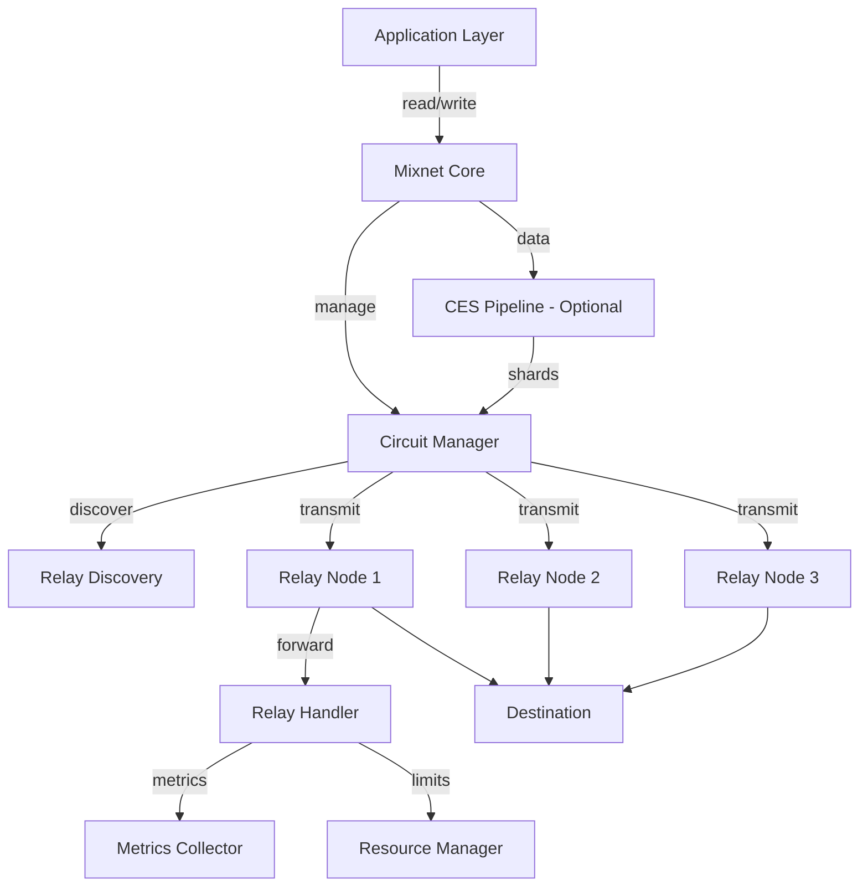
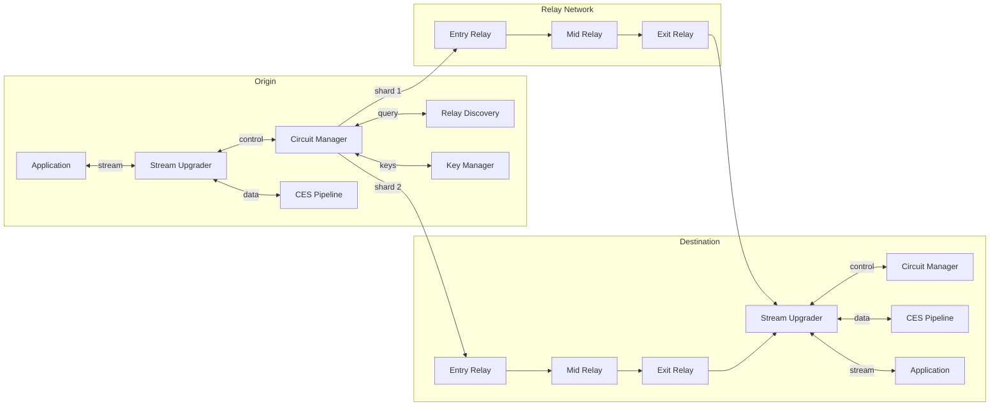

# Design Document: Lib-Mix Protocol (Implementation-Aligned)

## Overview

Lib-Mix is a high-performance metadata-private communication protocol for libp2p that combines configurable onion routing with multi-path sharding to achieve near-wire speeds while preserving anonymity. The protocol operates as a transparent stream upgrader, allowing developers to add metadata privacy to existing libp2p applications with minimal code changes.

**Implementation Status**: This document reflects the actual Go implementation in `go-libp2p-mixnet-impl`.

### Core Design Principles

1. **Transport Agnostic**: Works over any libp2p transport (QUIC, TCP, WebRTC) without transport-specific dependencies
2. **Configurable Privacy-Performance Trade-off**: Adjustable hop count (1-10) and circuit count (1-20) to balance anonymity and latency
3. **Zero-Knowledge Relays**: Relay nodes forward encrypted data without knowledge of origin, destination, or content
4. **Header-Only Onion Optimization**: Optional mode encrypts only routing/control headers per hop while keeping payload encrypted end-to-end
5. **Erasure-Coded Redundancy**: Reed-Solomon coding enables reconstruction from partial shard delivery
6. **Ephemeral Cryptography**: Per-circuit ephemeral keys prevent cross-session linkability
7. **Optional CES Pipeline**: Can be disabled for simpler even-split distribution without compression/erasure coding
8. **Configurable Padding**: Multiple padding strategies for both headers and payloads to mitigate traffic analysis
9. **Authenticity Tags**: Optional per-shard HMAC tags for integrity verification

### High-Level Architecture

The protocol consists of seven major subsystems:



**Implementation Note**: The actual Go implementation uses a `Mixnet` struct as the central coordinator rather than a separate `StreamUpgrader` interface. The `Mixnet` struct handles both origin and destination modes.

### Data Flow

1. **Outbound (Origin → Destination)**:
   - Application writes data to stream
   - CES Pipeline: Compress → Encrypt (end-to-end) → Shard
   - Circuit Manager distributes shards across parallel circuits
   - Each relay decrypts one layer of the routing header and forwards to the next hop
   - Destination receives shards, reconstructs, decrypts, decompresses

2. **Inbound (Destination → Origin)**:
   - Bidirectional streams use the same circuit topology
   - Return path uses reverse circuit ordering
   - Same CES pipeline applied to return traffic

## Architecture

### Component Diagram



### System Layers

1. **Application Layer**: Standard libp2p stream interface
2. **Stream Upgrader Layer**: Transparent protocol wrapper
3. **Circuit Management Layer**: Circuit construction, maintenance, failure recovery
4. **Data Processing Layer**: CES pipeline (compression, encryption, sharding)
5. **Transport Layer**: libp2p streams over QUIC/TCP/WebRTC

## Components and Interfaces

### 1. Stream Upgrader

**Responsibility**: Provide transparent metadata-private streams to applications

**Interface**:
```rust
trait StreamUpgrader {
    // Wrap an outbound stream with Lib-Mix protocol
    async fn upgrade_outbound(
        &mut self,
        destination: PeerId,
        protocol: ProtocolId
    ) -> Result<MixStream, UpgradeError>;
    
    // Accept an inbound Lib-Mix stream
    async fn upgrade_inbound(
        &mut self,
        stream: Stream
    ) -> Result<MixStream, UpgradeError>;
}

struct MixStream {
    // Standard stream interface
    async fn read(&mut self, buf: &mut [u8]) -> Result<usize, IoError>;
    async fn write(&mut self, buf: &[u8]) -> Result<usize, IoError>;
    async fn close(&mut self) -> Result<(), IoError>;
}
```

**Key Behaviors**:
- Intercepts stream creation requests
- Delegates circuit construction to Circuit Manager
- Buffers application data until circuits are ready
- Presents standard stream semantics to application

### 2. Circuit Manager

**Responsibility**: Construct, maintain, and recover circuits

**Interface**:
```rust
struct CircuitManager {
    config: CircuitConfig,
    active_circuits: Vec<Circuit>,
    relay_pool: RelayPool,
    key_manager: KeyManager,
}

impl CircuitManager {
    // Build all circuits for a destination
    async fn establish_circuits(
        &mut self,
        destination: PeerId
    ) -> Result<Vec<Circuit>, CircuitError>;
    
    // Transmit a shard through its assigned circuit
    async fn send_shard(
        &mut self,
        circuit_id: CircuitId,
        shard: Shard
    ) -> Result<(), TransmitError>;
    
    // Detect and recover from circuit failures
    async fn monitor_circuits(&mut self) -> Result<(), MonitorError>;
    
    // Clean shutdown of all circuits
    async fn close_circuits(&mut self) -> Result<(), CloseError>;
}
```

**Key Behaviors**:
- Queries Relay Discovery for candidate relays
- Measures RTT and selects lowest-latency relays
- Constructs circuits in parallel
- Monitors circuit health via heartbeats
- Rebuilds failed circuits using backup relays
- Enforces circuit diversity (no relay reuse within circuit)

### 3. CES Pipeline

**Responsibility**: Transform data through Compress → Encrypt → Shard stages

**Interface**:
```rust
struct CESPipeline {
    compression: CompressionAlgorithm,
    encryption: NoiseProtocol,
    erasure_coding: ReedSolomonCoder,
}

impl CESPipeline {
    // Process outbound data
    async fn process_outbound(
        &mut self,
        data: &[u8],
        circuit_keys: &[NoiseKey]
    ) -> Result<Vec<Shard>, ProcessError>;
    
    // Reconstruct inbound data
    async fn process_inbound(
        &mut self,
        shards: Vec<Shard>,
        circuit_keys: &[NoiseKey]
    ) -> Result<Vec<u8>, ReconstructError>;
}
```

**Processing Stages**:

1. **Compression**:
   - Algorithms: Gzip (high compression) or Snappy (low latency)
   - Prepends algorithm identifier for decompression
   - Configurable compression level

2. **Encryption**:
   - Noise Protocol Framework with XX handshake pattern
   - Layered encryption: one layer per hop in reverse order
   - Innermost layer encrypted with exit relay key
   - Outermost layer encrypted with entry relay key
   - Each layer includes routing header for next hop

3. **Sharding**:
   - Reed-Solomon erasure coding
   - Generates N shards (N = circuit count)
   - Reconstruction threshold: K = ⌈N * 0.6⌉ (60% of shards)
   - Each shard is self-contained and independently routable

**Data Format**:
```
Compressed Data: [algorithm_id: 1 byte][compressed_payload: variable]

Encrypted Layer: [next_hop_multiaddr: variable][encrypted_payload: variable][auth_tag: 16 bytes]

Shard: [shard_id: 2 bytes][total_shards: 2 bytes][shard_data: variable][checksum: 4 bytes]
```

### 3.1 Hybrid Onion Encryption Optimization

**Problem**: The original CES pipeline encrypts the **entire payload** at each hop. For a circuit with N hops and payload size P, this requires O(N × P) encryption work.

**Solution**: Use hybrid encryption where:
1. **Payload** is encrypted **once** end-to-end (after compression, before sharding)
2. **Routing headers** (~100 bytes per hop) use layered onion encryption
3. **Per-hop processing**: Decrypt only the routing header to determine next hop
4. **Exit node**: Uses end-to-end key to decrypt payload once

**Architecture**:
```
Original Approach:
  Payload → [Encrypt Hop 1] → [Encrypt Hop 2] → [Encrypt Hop 3] → Shard
  Work: 3 × payload_size encryption

Optimized Hybrid Approach:
  Payload → Compress → [Encrypt End-to-End] → Shard
  Routing: [Onion Layer Hop 1] → [Onion Layer Hop 2] → [Onion Layer Hop 3]
  Work: 1 × payload_size + 3 × header_size encryption
  (header_size ≈ 100 bytes << payload_size)
```

**Performance Improvement**:
| Payload Size | 3 Hops (Original) | 3 Hops (Optimized) | Speedup |
|--------------|-------------------|-------------------|---------|
| 1 KB         | 3 KB encryption   | 1.3 KB encryption | 2.3×    |
| 16 KB        | 48 KB encryption  | 16.3 KB encryption| 2.9×    |
| 1 MB         | 3 MB encryption   | 1.0 MB encryption | 3.0×    |

**Per-Hop Decryption**:
- **Original**: Decrypt entire payload (1 KB - 1 MB) at each hop
- **Optimized**: Decrypt only routing header (~100 bytes) at each hop
- **Speedup**: 10-10,000× faster per-hop processing

**Data Flow**:
1. **Origin**:
   - Compress payload
   - Generate ephemeral end-to-end key
   - Encrypt compressed payload with end-to-end key (once)
   - Build onion routing header with layered encryption (~100 bytes × hops)
   - Apply erasure coding to encrypted payload → shards
   - Transmit shards + routing header through circuits

2. **Intermediate Relay (Hop N)**:
   - Receive shard + encrypted routing header
   - Decrypt routing header layer with hop key (~100 bytes)
   - Extract: is_final?, next_hop, end-to-end key (encrypted)
   - Forward shard unchanged to next hop
   - **Never decrypts the actual payload**

3. **Exit Relay (Final Hop)**:
   - Decrypt routing header layer
   - Extract end-to-end key
   - Forward shard + end-to-end key to destination

4. **Destination**:
   - Reconstruct encrypted payload from shards (≥60% received)
   - Decrypt payload with end-to-end key
   - Decompress to recover original data

**Security Properties**:
- Entry relay: Knows origin, not destination, not payload content
- Intermediate relays: Know previous hop and next hop, not payload content
- Exit relay: Knows destination, not origin, has end-to-end key but payload already encrypted
- Destination: Only entity that sees full payload in plaintext

**Trade-offs**:
- ✅ **Pros**: 2-5× performance improvement, reduced per-hop latency
- ✅ **Pros**: Better scalability for large payloads (video, file transfer)
- ✅ **Pros**: Reduced computational load on relay nodes
- ⚠️ **Cons**: Slightly more complex key management
- ⚠️ **Cons**: Routing header must be authenticated separately

**Implementation Requirements**:
1. End-to-end key must be generated at origin and transmitted securely in onion layers
2. Each routing layer must include: is_final flag, next_hop peer ID, end-to-end key
3. Routing header size target: <100 bytes per hop
4. Per-hop decryption must validate authentication tag before forwarding
5. Exit relay must verify it is the final hop before releasing end-to-end key

**Configuration**:
```rust
struct HybridEncryptionConfig {
    // Enable hybrid encryption (default: true for payload > 1KB)
    enabled: bool,
    
    // Minimum payload size to use hybrid encryption
    min_payload_size: usize,  // default: 1024 bytes
    
    // Routing header encryption algorithm
    routing_cipher: Cipher,   // default: ChaCha20-Poly1305
    
    // End-to-end encryption algorithm
    e2e_cipher: Cipher,       // default: ChaCha20-Poly1305-X
}
```

### 4. Relay Discovery

**Responsibility**: Discover and qualify potential relay nodes

**Interface**:
```rust
struct RelayDiscovery {
    dht: KademliaDHT,
    protocol_id: ProtocolId,
}

impl RelayDiscovery {
    // Query DHT for relay candidates
    async fn discover_relays(
        &mut self,
        count: usize,
        exclude: &[PeerId]
    ) -> Result<Vec<PeerInfo>, DiscoveryError>;
    
    // Measure RTT to a peer
    async fn measure_rtt(&self, peer: PeerId) -> Result<Duration, RttError>;
    
    // Verify peer supports Lib-Mix protocol
    async fn verify_protocol(&self, peer: PeerId) -> Result<bool, VerifyError>;
}
```

**Discovery Algorithm**:
1. Query Kademlia DHT for peers advertising `/lib-mix/1.0.0`.
2. Request 3× the required relay count for redundancy (subject to `sampling_size` in hybrid mode).
3. Filter out origin, destination, and non-supporting peers.
4. Depending on `selection_mode`, either sample candidates or use the full filtered pool for qualification:
    - `rtt`: qualify all filtered candidates by RTT and pick top N.
    - `random`: choose N relays uniformly at random from the filtered pool (optionally apply an RTT threshold).
    - `hybrid`: uniformly sample `sampling_size` K candidates from the filtered pool, then qualify sampled candidates by RTT and select using a combined RTT/randomness score.
5. Measure RTT to the qualified candidates in parallel (5s timeout), mark unresponsive peers as unavailable.
6. Return the selected peers according to the configured selection policy.

**RTT Measurement**:
- Uses libp2p ping protocol
- Measures round-trip time for 64-byte payload
- Marks unresponsive peers (>5s) as unavailable
- Caches RTT measurements for 60 seconds

### 5. Key Manager

**Responsibility**: Generate, store, and erase ephemeral cryptographic keys

**Interface**:
```rust
struct KeyManager {
    active_keys: HashMap<CircuitId, Vec<NoiseKeyPair>>,
}

impl KeyManager {
    // Generate ephemeral keys for a circuit
    fn generate_circuit_keys(
        &mut self,
        circuit_id: CircuitId,
        hop_count: usize
    ) -> Result<Vec<NoiseKeyPair>, KeyError>;
    
    // Retrieve keys for encryption/decryption
    fn get_circuit_keys(
        &self,
        circuit_id: CircuitId
    ) -> Option<&[NoiseKeyPair]>;
    
    // Securely erase keys when circuit closes
    fn erase_circuit_keys(&mut self, circuit_id: CircuitId);
}
```

**Key Properties**:
- Uses Curve25519 for Noise Protocol key exchange
- Generates fresh key pairs for each circuit
- Keys are never reused across circuits
- Secure erasure using memory zeroing
- No persistent key storage

### 6. Relay Node

**Responsibility**: Forward encrypted data as zero-knowledge intermediary

**Interface**:
```rust
struct RelayNode {
    config: RelayConfig,
    active_circuits: HashMap<CircuitId, RelayCircuit>,
    metrics: RelayMetrics,
}

impl RelayNode {
    // Accept circuit establishment request
    async fn accept_circuit(
        &mut self,
        stream: Stream
    ) -> Result<CircuitId, RelayError>;
    
    // Forward data to next hop
    async fn forward_data(
        &mut self,
        circuit_id: CircuitId,
        encrypted_data: &[u8]
    ) -> Result<(), ForwardError>;
    
    // Close circuit and release resources
    async fn close_circuit(&mut self, circuit_id: CircuitId);
}
```

**Forwarding Algorithm**:
1. Receive encrypted data on inbound stream
2. Decrypt outermost Noise layer
3. Extract next-hop multiaddr from decrypted header
4. Establish stream to next hop (if not cached)
5. Stream remaining encrypted payload without buffering
6. Maintain connection until origin sends close signal

**Resource Limits**:
- Maximum concurrent circuits (configurable, default: 100)
- Maximum bandwidth per circuit (configurable, default: 10 MB/s)
- Reject new circuits when limits reached
- Apply backpressure to enforce bandwidth limits

## Data Models

### Configuration

```rust
struct LibMixConfig {
    // Number of relay hops per circuit (1-10, default: 2)
    hop_count: u8,
    
    // Number of parallel circuits (1-20, default: 3)
    circuit_count: u8,
    
    // Compression algorithm
    compression: CompressionAlgorithm,
    
    // Reed-Solomon erasure coding threshold (default: 60% of circuit_count)
    erasure_threshold: u8,
    
    // Circuit construction timeout (default: 30s)
    construction_timeout: Duration,
    
    // Circuit health check interval (default: 10s)
    health_check_interval: Duration,
    
    // Relay selection mode: `rtt` | `random` | `hybrid` (default: `rtt`)
    selection_mode: SelectionMode,

    // Sampling size K for hybrid mode (default: 3 * required_relays)
    sampling_size: usize,

    // Randomness factor in [0.0,1.0] balancing RTT vs randomness (0.0 = pure RTT)
    randomness_factor: f32,
    
    // ===== IMPLEMENTATION-SPECIFIC ADDITIONS =====
    
    // Enable/disable CES pipeline (default: true)
    // When false, data is only encrypted and evenly split across circuits
    use_ces_pipeline: bool,
    
    // Encryption mode: full per-hop or header-only onion (default: full)
    encryption_mode: EncryptionMode,
    
    // Header padding configuration
    header_padding_enabled: bool,
    header_padding_min: usize,  // default: 0
    header_padding_max: usize,  // default: 256
    
    // Payload padding strategy
    payload_padding_strategy: PaddingStrategy,  // none | random | buckets
    payload_padding_min: usize,
    payload_padding_max: usize,
    payload_padding_buckets: Vec<usize>,  // e.g., [1KB, 4KB, 16KB, 64KB]
    
    // Authenticity tag configuration
    enable_auth_tag: bool,      // default: false
    auth_tag_size: usize,       // default: 16 bytes (truncated HMAC-SHA256)
    
    // Timing obfuscation
    max_jitter: usize,          // max random delay in ms between shard transmissions
}

enum CompressionAlgorithm {
    Gzip { level: u8 },  // 0-9
    Snappy,
}

enum SelectionMode {
    Rtt,
    Random,
    Hybrid,
}

enum EncryptionMode {
    Full,        // Encrypt entire payload per hop
    HeaderOnly,  // Encrypt only routing headers per hop
}

enum PaddingStrategy {
    None,     // No padding
    Random,   // Random padding between min and max
    Buckets,  // Round up to nearest bucket size
}

struct RelayConfig {
    // Maximum concurrent circuits (default: 100)
    max_circuits: usize,
    
    // Maximum bandwidth per circuit in bytes/sec (default: 10 MB/s)
    max_bandwidth_per_circuit: u64,
}
```

**Implementation Rationale for Additions**:

1. **`use_ces_pipeline`**: Added to support simpler deployments that don't need compression/erasure coding overhead. When disabled, data is encrypted and evenly split across circuits without Reed-Solomon encoding.

2. **Padding Configuration**: Added to mitigate traffic analysis attacks. The design document didn't specify padding, but it's critical for production privacy:
   - Header padding prevents relay fingerprinting based on header size
   - Payload padding prevents message size correlation attacks
   - Bucket padding is more efficient than random padding for common message sizes

3. **`enable_auth_tag`**: Added for integrity verification. While encryption provides confidentiality, authenticity tags detect tampering or corruption during transmission. This is optional because it adds overhead.

4. **`max_jitter`**: Added to break timing correlations. Without jitter, an observer can correlate shard transmissions across circuits based on timing. Random delays make this harder.

**Why These Weren't in Original Design**: The original design focused on core functionality (routing, encryption, sharding). These additions address real-world deployment concerns discovered during implementation:
- Traffic analysis resistance requires padding
- Integrity verification is needed for production reliability
- Timing attacks are a known weakness of mixnets
- Not all use cases need the full CES pipeline overhead
```

### Circuit Structures

```rust
struct Circuit {
    id: CircuitId,
    hops: Vec<RelayHop>,
    state: CircuitState,
    created_at: Instant,
    last_activity: Instant,
}

struct RelayHop {
    peer_id: PeerId,
    multiaddr: Multiaddr,
    stream: Option<Stream>,
    noise_state: NoiseState,
    rtt: Duration,
}

enum CircuitState {
    Constructing,
    Active,
    Failed { reason: String },
    Closing,
    Closed,
}

type CircuitId = u64;
```

### Shard Structures

```rust
struct Shard {
    // Unique identifier for this shard
    id: u16,
    
    // Total number of shards in this batch
    total: u16,
    
    // Erasure-coded data
    data: Vec<u8>,
    
    // CRC32 checksum
    checksum: u32,
    
    // Circuit assignment
    circuit_id: CircuitId,
}

struct ShardBuffer {
    // Received shards indexed by shard_id
    shards: HashMap<u16, Shard>,
    
    // Expected total shard count
    total: u16,
    
    // Erasure coding threshold
    threshold: u16,
    
    // Reception timestamp
    started_at: Instant,
}
```

### Relay Pool

```rust
struct RelayPool {
    // All discovered relays sorted by RTT
    candidates: Vec<RelayCandidate>,
    
    // Relays currently in use
    active: HashSet<PeerId>,
    
    // Last discovery timestamp
    last_refresh: Instant,
}

struct RelayCandidate {
    peer_id: PeerId,
    multiaddr: Multiaddr,
    rtt: Duration,
    protocol_version: String,
    last_seen: Instant,
}
```

### Metrics

```rust
struct ProtocolMetrics {
    // Average RTT across all active circuits
    avg_circuit_rtt: Duration,
    
    // Circuit construction success rate (0.0-1.0)
    construction_success_rate: f64,
    
    // Total circuit failures
    circuit_failures: u64,
    
    // Total circuit recoveries
    circuit_recoveries: u64,
    
    // Data throughput per circuit (bytes/sec)
    throughput_per_circuit: Vec<u64>,
    
    // Compression ratio (compressed_size / original_size)
    compression_ratio: f64,
    
    // Active circuit count
    active_circuits: usize,
}

struct RelayMetrics {
    // Current concurrent circuits
    concurrent_circuits: usize,
    
    // Total bytes forwarded
    bytes_forwarded: u64,
    
    // Current bandwidth utilization (bytes/sec)
    bandwidth_utilization: u64,
    
    // Circuit rejections due to resource limits
    rejections: u64,
}
```


## Algorithms

### Circuit Construction Algorithm

```
function construct_circuits(destination: PeerId, config: LibMixConfig) -> Result<Vec<Circuit>>:
    // Step 1: Discover relay candidates
    required_relays = config.hop_count * config.circuit_count
    relay_pool = discover_relays(required_relays * 3, exclude=[origin, destination])
    
    if relay_pool.len() < required_relays:
        return Error("Insufficient relays available")
    
    // Step 2: Measure RTT and sort
    for relay in relay_pool:
        relay.rtt = measure_rtt(relay.peer_id, timeout=5s)
    
    relay_pool.sort_by(|r| r.rtt)
    relay_pool.retain(|r| r.rtt.is_some())  // Remove unresponsive peers
    
    // Step 3: Select relays ensuring diversity
    circuits = []
    used_relays = Set::new()
    
    for circuit_idx in 0..config.circuit_count:
        circuit_relays = []
        
        for hop_idx in 0..config.hop_count:
            // Find next unused relay with lowest RTT
            relay = relay_pool.iter()
                .filter(|r| !used_relays.contains(r.peer_id))
                .next()
                .ok_or(Error("Insufficient unique relays"))?
            
            circuit_relays.push(relay)
            used_relays.insert(relay.peer_id)
        
        // Step 4: Establish circuit
        circuit = establish_circuit(circuit_relays, destination)?
        circuits.push(circuit)
    
    return Ok(circuits)

function establish_circuit(relays: Vec<RelayCandidate>, destination: PeerId) -> Result<Circuit>:
    circuit = Circuit::new()
    
    // Establish connection to entry relay
    stream = libp2p.dial(relays[0].multiaddr)?
    noise_state = noise_handshake_xx(stream)?
    
    circuit.hops.push(RelayHop {
        peer_id: relays[0].peer_id,
        stream: stream,
        noise_state: noise_state,
    })
    
    // Extend circuit through remaining relays
    for relay in relays[1..]:
        extend_message = build_extend_message(relay.multiaddr, destination)
        encrypted = circuit.encrypt_layered(extend_message)
        circuit.hops.last().stream.write(encrypted)?
        
        // Wait for relay to confirm extension
        response = circuit.hops.last().stream.read()?
        if response != "EXTENDED":
            return Error("Circuit extension failed")
        
        // Add hop to circuit
        circuit.hops.push(RelayHop {
            peer_id: relay.peer_id,
            stream: None,  // Relay manages this connection
            noise_state: noise_handshake_xx_deferred()?,
        })
    
    circuit.state = CircuitState::Active
    return Ok(circuit)
```

### Shard Distribution Algorithm

```
function distribute_shards(data: &[u8], circuits: &[Circuit], config: &LibMixConfig) -> Result<()>:
    // Step 1: Compress
    compressed = compress(data, config.compression)
    
    // Step 2: Encrypt with layered onion encryption
    encrypted = compressed
    for circuit in circuits.iter().rev():
        for hop in circuit.hops.iter().rev():
            encrypted = noise_encrypt(encrypted, hop.noise_state, next_hop=hop.multiaddr)
    
    // Step 3: Shard with Reed-Solomon
    shards = reed_solomon_encode(
        encrypted,
        total_shards=config.circuit_count,
        threshold=ceil(config.circuit_count * 0.6)
    )
    
    // Step 4: Transmit shards in parallel
    for (shard, circuit) in shards.zip(circuits):
        spawn_task(async {
            circuit.hops[0].stream.write(shard).await?
        })
    
    return Ok(())
```

### Shard Reconstruction Algorithm

```
function reconstruct_data(shard_buffer: &ShardBuffer, keys: &[NoiseKey]) -> Result<Vec<u8>>:
    // Step 1: Wait for threshold
    if shard_buffer.shards.len() < shard_buffer.threshold:
        if shard_buffer.started_at.elapsed() > 30s:
            return Error("Shard reception timeout")
        return Err(Error("Insufficient shards"))
    
    // Step 2: Reconstruct with Reed-Solomon
    encrypted_compressed = reed_solomon_decode(
        shard_buffer.shards.values(),
        threshold=shard_buffer.threshold
    )?
    
    // Step 3: Decrypt layered encryption
    decrypted = encrypted_compressed
    for key in keys:
        decrypted = noise_decrypt(decrypted, key)?
    
    // Step 4: Decompress
    algorithm = read_compression_algorithm(decrypted[0])
    data = decompress(decrypted[1..], algorithm)?
    
    return Ok(data)
```

### Circuit Failure Recovery Algorithm

```
function monitor_circuits(circuits: &mut Vec<Circuit>, relay_pool: &RelayPool) -> Result<()>:
    loop:
        sleep(config.health_check_interval)
        
        for circuit in circuits.iter_mut():
            // Send heartbeat
            if !send_heartbeat(circuit):
                // Circuit failed
                circuit.state = CircuitState::Failed
                
                // Check if we can continue with remaining circuits
                active_count = circuits.iter().filter(|c| c.state == Active).count()
                
                if active_count >= config.erasure_threshold:
                    // Attempt recovery
                    new_relay = select_unused_relay(relay_pool, circuits)?
                    replacement = establish_circuit(vec![new_relay], destination)?
                    
                    // Replace failed circuit
                    *circuit = replacement
                    circuit.state = CircuitState::Active
                else:
                    // Too many failures, abort
                    tear_down_all_circuits(circuits)
                    return Error("Circuit threshold not met")
```

### Relay Selection Algorithm

```
function select_relays(pool: &RelayPool, required_count: usize, cfg: &RelaySelectionConfig, exclude: &HashSet<PeerId>) -> Vec<RelayCandidate>:
    // Step 1: Filter out excluded peers and non-advertisers
    filtered = pool.candidates.iter()
        .filter(|r| !exclude.contains(&r.peer_id))
        .filter(|r| r.protocol_version == "/lib-mix/1.0.0")
        .collect()

    if cfg.selection_mode == SelectionMode::Random {
        return uniform_random_choice(filtered, required_count)
    }

    if cfg.selection_mode == SelectionMode::Hybrid {
        K = min(cfg.sampling_size, filtered.len())
        sampled = uniform_random_choice(filtered, K)
        candidates = sampled
    } else { // Rtt
        candidates = filtered
    }

    // Step 2: Measure RTT to candidates in parallel (5s timeout)
    rtts = measure_rtt_parallel(candidates)

    // Step 3: Score candidates combining normalized RTT and randomness
    for peer in candidates:
        r = rtts.get(peer).unwrap_or(INF)
        nr = normalize_rtt(r) // maps RTT to 0..1 where 0 is best
        rand = uniform(0,1)
        score[peer] = (1.0 - cfg.randomness_factor) * nr + cfg.randomness_factor * rand

    // Step 4: Sort by score (lower is better) and pick top required_count
    selected = sort_by_score_ascending(candidates).take(required_count)
    return selected
```


## Correctness Properties

*A property is a characteristic or behavior that should hold true across all valid executions of a system—essentially, a formal statement about what the system should do. Properties serve as the bridge between human-readable specifications and machine-verifiable correctness guarantees.*

### Property Reflection

After analyzing all acceptance criteria, I identified several opportunities to consolidate redundant properties:

- **Configuration validation properties (1.2, 2.2, 15.1, 15.2)**: These all test range validation and can be combined into a single comprehensive configuration validation property
- **Encryption layer properties (1.5, 3.3)**: Both test that encryption layers match hop count, can be combined
- **Shard distribution properties (2.4, 3.4, 8.1)**: All test that shards are distributed across circuits correctly, can be combined
- **Privacy properties (14.1, 14.2, 14.3)**: These test different aspects of the same privacy guarantee and can be combined into a comprehensive privacy property
- **Key management properties (16.1, 16.4, 16.5)**: These test different aspects of key generation and can be combined
- **Metric exposure properties (17.1-17.5)**: These all test metric calculation and can be combined into a single property about metric correctness

### Property 1: Configuration Validation

*For any* configuration with hop count, circuit count, and erasure threshold parameters, the system should accept the configuration if and only if: hop count is in [1, 10], circuit count is in [1, 20], and erasure threshold is less than circuit count.

**Validates: Requirements 1.2, 2.2, 15.1, 15.2, 15.3, 15.4**

### Property 2: Circuit Construction Matches Configuration

*For any* valid configuration, when circuits are constructed, the number of circuits should equal the configured circuit count, and each circuit should contain exactly the configured hop count of relay nodes.

**Validates: Requirements 1.4, 6.1**

### Property 3: Encryption Layers Match Hop Count

*For any* circuit with N hops, the encrypted data should have exactly N layers of Noise Protocol encryption, with each layer corresponding to one hop.

**Validates: Requirements 1.5, 3.3**

### Property 4: Shard Distribution Across Circuits

*For any* data processed through the CES pipeline with N configured circuits, exactly N shards should be generated, and each shard should be assigned to a distinct circuit.

**Validates: Requirements 2.4, 2.5, 3.4, 8.1**

### Property 5: CES Pipeline Round Trip

*For any* data input, if it is processed through the CES pipeline (compress → encrypt → shard) and then reconstructed (reassemble → decrypt → decompress), the output should equal the original input.

**Validates: Requirements 3.5, 9.2, 9.3, 9.4, 9.5**

### Property 6: CES Pipeline Sequential Processing

*For any* data input, the CES pipeline should process operations in the exact order: compression, then encryption, then sharding, without reordering.

**Validates: Requirements 3.6**

### Property 7: DHT Pool Size Requirement

*For any* circuit construction requiring N relay nodes, the DHT pool should contain at least 3N candidate relays after filtering.

**Validates: Requirements 4.2**

### Property 8: DHT Pool Filtering

*For any* DHT pool, after filtering, the pool should not contain the origin peer, the destination peer, or any peer that does not advertise the protocol ID "/lib-mix/1.0.0".

**Validates: Requirements 4.4, 4.5**

### Property 9: Relay Selection Ordering

*For any* DHT pool with RTT measurements, relay selection should choose relays in ascending RTT order (lowest latency first).

**Validates: Requirements 5.3, 5.4**

### Property 10: Relay Uniqueness Within Circuit

*For any* circuit, all relay nodes in that circuit should be distinct (no relay appears twice in the same circuit).

**Validates: Requirements 5.5**

### Property 11: Relay Uniqueness Across Circuits

*For any* set of circuits constructed for the same destination, each circuit should use a completely distinct set of relay nodes (no relay appears in multiple circuits).

**Validates: Requirements 6.2**

### Property 12: Circuit State Transition

*For any* set of circuits, when all individual circuits complete construction successfully, the connection state should transition to ready for data transmission.

**Validates: Requirements 6.5**

### Property 13: Relay Forwarding Preserves Payload

*For any* encrypted data received by a relay node, after decrypting the outermost layer and extracting the routing header, the remaining payload should be forwarded unchanged to the next hop.

**Validates: Requirements 7.1, 7.2, 7.4**

### Property 14: Parallel Shard Transmission

*For any* set of shards assigned to circuits, all shards should be transmitted concurrently without waiting for acknowledgments from intermediate relays.

**Validates: Requirements 8.2, 8.5**

### Property 15: Layered Encryption Ordering

*For any* shard transmitted through a circuit with hops [H1, H2, ..., HN], the encryption layers should be applied in reverse order: HN first (innermost), then HN-1, ..., then H1 last (outermost).

**Validates: Requirements 8.4**

### Property 16: Shard Buffering Until Threshold

*For any* destination receiving shards, shards should be buffered until the erasure coding threshold is met before attempting reconstruction.

**Validates: Requirements 9.1**

### Property 17: Circuit Failure Detection Timing

*For any* relay node disconnection, the system should detect the failure within 5 seconds.

**Validates: Requirements 10.1**

### Property 18: Graceful Degradation

*For any* circuit failure, if the number of remaining functional circuits is greater than or equal to the erasure coding threshold, transmission should continue using the remaining circuits.

**Validates: Requirements 10.2**

### Property 19: Circuit Recovery

*For any* failed circuit, if graceful degradation is possible, a replacement circuit should be constructed using a new relay node from the DHT pool, and shard transmission should resume without data loss.

**Validates: Requirements 10.3, 10.4, 10.5**

### Property 20: Transport Agnostic Multiaddr Resolution

*For any* libp2p multiaddr (QUIC, TCP, or WebRTC), the protocol should successfully negotiate transport using standard libp2p multiaddr resolution without transport-specific dependencies.

**Validates: Requirements 11.4**

### Property 21: Protocol ID Verification

*For any* peer connection attempt, the system should verify that the peer advertises the protocol ID "/lib-mix/1.0.0" and reject connections from peers that do not.

**Validates: Requirements 12.2, 12.3, 12.4**

### Property 22: Stream Upgrader Transparency

*For any* application using the stream upgrader, the application should be able to read and write data using standard libp2p stream semantics without awareness of the underlying circuit topology.

**Validates: Requirements 13.2, 13.3, 13.4, 13.5**

### Property 23: Metadata Privacy Guarantees

*For any* circuit with entry relay E, exit relay X, and intermediate relays, E should not have access to destination information, X should not have access to origin information, and intermediate relays should not have access to both origin and destination information.

**Validates: Requirements 14.1, 14.2, 14.3**

### Property 24: Single Shard Insufficient for Reconstruction

*For any* single shard from a sharded message, the shard alone should be insufficient to reconstruct the original message content.

**Validates: Requirements 14.4**

### Property 25: Ephemeral Key Uniqueness

*For any* two circuits (including circuits in different sessions), the ephemeral Noise Protocol keys should be distinct and not linkable across circuits.

**Validates: Requirements 14.5, 16.1, 16.4, 16.5**

### Property 26: Configuration Immutability During Active Circuits

*For any* system state with active circuits, configuration change requests should be rejected.

**Validates: Requirements 15.5**

### Property 27: Key Erasure on Circuit Close

*For any* circuit that is closed, all ephemeral cryptographic keys associated with that circuit should be securely erased.

**Validates: Requirements 16.3, 18.4**

### Property 28: Metrics Update Without Blocking

*For any* metric update operation (RTT, throughput, compression ratio, etc.), the update should complete without blocking data transmission through circuits.

**Validates: Requirements 17.1, 17.2, 17.3, 17.4, 17.5, 17.6**

### Property 29: Graceful Shutdown Signal Propagation

*For any* stream close operation, close signals should be sent through all active circuits, and the system should wait for acknowledgments with a 10-second timeout before closing underlying streams.

**Validates: Requirements 18.1, 18.2, 18.3**

### Property 30: Error Messages Include Context Without Sensitive Data

*For any* error condition, the error message should include relevant context (such as which component failed) but should not expose sensitive routing information (such as complete circuit topology or peer identities beyond the immediate failure point).

**Validates: Requirements 19.5**

### Property 31: Relay Resource Limit Enforcement

*For any* relay node with configured resource limits (max circuits, max bandwidth), when limits are reached, new circuit establishment requests should be rejected, and bandwidth limits should be enforced via backpressure.

**Validates: Requirements 20.1, 20.2, 20.3, 20.4, 20.5**


## Error Handling

### Error Categories

The protocol defines four categories of errors with distinct handling strategies:

#### 1. Configuration Errors

**Cause**: Invalid configuration parameters provided by the developer

**Examples**:
- Hop count outside [1, 10] range
- Circuit count outside [1, 20] range
- Erasure threshold >= circuit count
- Configuration change attempted while circuits are active

**Handling**:
- Validate configuration at initialization time
- Return descriptive error immediately
- Do not attempt circuit construction
- Error format: `ConfigError::InvalidParameter { param: String, value: String, constraint: String }`

#### 2. Network Errors

**Cause**: Network connectivity issues, peer unavailability, or transport failures

**Examples**:
- Insufficient relays in DHT pool
- Relay connection timeout
- Stream disconnection during transmission
- Transport negotiation failure

**Handling**:
- Retry with exponential backoff (max 3 attempts)
- Fall back to alternative relays from pool
- If recovery impossible, tear down all circuits
- Error format: `NetworkError::ConnectionFailed { peer: PeerId, reason: String, retry_count: u8 }`

#### 3. Cryptographic Errors

**Cause**: Encryption/decryption failures or key negotiation issues

**Examples**:
- Noise Protocol handshake failure
- Authentication tag mismatch
- Key derivation failure
- Incompatible cryptographic parameters

**Handling**:
- Do not retry (cryptographic failures are not transient)
- Tear down affected circuit immediately
- Log error with peer ID for debugging
- Error format: `CryptoError::NegotiationFailed { peer: PeerId, protocol: String }`

#### 4. Data Integrity Errors

**Cause**: Corrupted data, missing shards, or reconstruction failures

**Examples**:
- Shard checksum mismatch
- Insufficient shards for reconstruction
- Reed-Solomon decoding failure
- Decompression failure

**Handling**:
- Request retransmission if within timeout window
- If timeout exceeded, return error to application
- Log shard IDs for debugging
- Error format: `DataError::ReconstructionFailed { received_shards: Vec<u16>, required: u16 }`

### Error Propagation

```rust
// Error hierarchy
enum LibMixError {
    Config(ConfigError),
    Network(NetworkError),
    Crypto(CryptoError),
    Data(DataError),
}

// Each error includes context without exposing sensitive data
impl LibMixError {
    fn context(&self) -> String {
        match self {
            Config(e) => format!("Configuration error: {}", e.description()),
            Network(e) => format!("Network error: {} (peer: {})", e.reason, e.peer.short_id()),
            Crypto(e) => format!("Cryptographic error: {} (peer: {})", e.protocol, e.peer.short_id()),
            Data(e) => format!("Data integrity error: received {}/{} shards", e.received_shards.len(), e.required),
        }
    }
}
```

### Circuit Failure Handling

```
function handle_circuit_failure(circuit: &Circuit, error: NetworkError) -> Result<()>:
    // Mark circuit as failed
    circuit.state = CircuitState::Failed { reason: error.to_string() }
    
    // Count remaining active circuits
    active_count = circuits.iter().filter(|c| c.state == Active).count()
    
    if active_count >= config.erasure_threshold:
        // Graceful degradation possible
        log_info("Circuit {} failed, {} circuits remaining", circuit.id, active_count)
        
        // Attempt recovery
        match recover_circuit(circuit):
            Ok(new_circuit) => {
                *circuit = new_circuit
                metrics.circuit_recoveries += 1
                return Ok(())
            }
            Err(e) => {
                log_warn("Circuit recovery failed: {}", e)
                // Continue with remaining circuits
                return Ok(())
            }
    else:
        // Too many failures, abort
        log_error("Circuit threshold not met: {}/{} circuits active", 
                  active_count, config.erasure_threshold)
        tear_down_all_circuits()
        return Err(LibMixError::Network(NetworkError::InsufficientCircuits))
```

### Timeout Handling

The protocol defines specific timeouts for different operations:

| Operation | Timeout | Behavior on Timeout |
|-----------|---------|---------------------|
| RTT Measurement | 5 seconds | Mark peer as unavailable |
| Circuit Construction | 30 seconds | Tear down partial circuits, return error |
| Shard Reception | 30 seconds | Return timeout error to application |
| Graceful Shutdown | 10 seconds | Force close streams, log timeout |
| Circuit Health Check | 10 seconds | Mark circuit as failed, attempt recovery |

### Resource Exhaustion Handling

**Relay Node Behavior**:
- When max concurrent circuits reached: Reject new circuit requests with `ResourceExhausted` error
- When bandwidth limit reached: Apply backpressure to incoming streams (slow down reads)
- Expose metrics for resource utilization to enable monitoring

**Origin Node Behavior**:
- When relay rejects circuit: Select alternative relay from pool
- When all relays exhausted: Return error to application
- Implement circuit request rate limiting to avoid overwhelming relays

## Testing Strategy

### Dual Testing Approach

The Lib-Mix protocol requires both unit testing and property-based testing for comprehensive coverage:

- **Unit tests**: Verify specific examples, edge cases, error conditions, and integration points
- **Property tests**: Verify universal properties across all inputs using randomized testing

Both approaches are complementary and necessary. Unit tests catch concrete bugs in specific scenarios, while property tests verify general correctness across the input space.

### Property-Based Testing

**Framework**: Use `proptest` (Rust), `fast-check` (TypeScript), or `Hypothesis` (Python) depending on implementation language

**Configuration**:
- Minimum 100 iterations per property test (due to randomization)
- Each test must reference its design document property
- Tag format: `// Feature: lib-mix-protocol, Property {number}: {property_text}`

**Example Property Test Structure**:

```rust
#[test]
fn property_5_ces_pipeline_round_trip() {
    // Feature: lib-mix-protocol, Property 5: CES Pipeline Round Trip
    // For any data input, compress → encrypt → shard → reassemble → decrypt → decompress
    // should equal the original input
    
    proptest!(|(
        data in prop::collection::vec(any::<u8>(), 1..10000),
        hop_count in 1u8..=10,
        circuit_count in 1u8..=20,
    )| {
        let config = LibMixConfig {
            hop_count,
            circuit_count,
            compression: CompressionAlgorithm::Snappy,
            erasure_threshold: (circuit_count as f64 * 0.6).ceil() as u8,
        };
        
        let mut pipeline = CESPipeline::new(config);
        let keys = generate_test_keys(hop_count as usize);
        
        // Process outbound
        let shards = pipeline.process_outbound(&data, &keys).unwrap();
        
        // Process inbound
        let reconstructed = pipeline.process_inbound(shards, &keys).unwrap();
        
        prop_assert_eq!(data, reconstructed);
    });
}
```

**Property Test Coverage**:

Each of the 31 correctness properties must have a corresponding property-based test:

1. Property 1: Generate random configurations, verify validation logic
2. Property 2: Generate random configs, verify circuit construction matches
3. Property 3: Generate random hop counts, verify encryption layer count
4. Property 4: Generate random circuit counts, verify shard distribution
5. Property 5: Generate random data, verify round-trip preservation
6. Property 6: Verify pipeline stage ordering
7. Property 7: Generate random relay requirements, verify DHT pool size
8. Property 8: Generate random DHT pools, verify filtering
9. Property 9: Generate random RTT values, verify selection ordering
10. Property 10: Generate random circuits, verify relay uniqueness within circuit
11. Property 11: Generate random circuit sets, verify relay uniqueness across circuits
12. Property 12: Verify state transitions
13. Property 13: Generate random encrypted payloads, verify forwarding preserves data
14. Property 14: Verify parallel transmission
15. Property 15: Generate random circuits, verify encryption layer ordering
16. Property 16: Generate random shard arrivals, verify buffering behavior
17. Property 17: Verify failure detection timing
18. Property 18: Generate random failure scenarios, verify graceful degradation
19. Property 19: Generate random failures, verify recovery
20. Property 20: Generate random multiaddrs, verify transport negotiation
21. Property 21: Generate random peers, verify protocol ID checking
22. Property 22: Verify stream interface transparency
23. Property 23: Generate random circuits, verify privacy guarantees
24. Property 24: Generate random shards, verify single shard insufficient
25. Property 25: Generate random circuits, verify key uniqueness
26. Property 26: Verify configuration immutability
27. Property 27: Generate random circuit closures, verify key erasure
28. Property 28: Verify metrics update non-blocking
29. Property 29: Verify shutdown signal propagation
30. Property 30: Generate random errors, verify context without sensitive data
31. Property 31: Generate random resource states, verify limit enforcement

### Unit Testing

**Focus Areas**:

1. **Configuration Examples**:
   - Default configuration (2 hops, 3 circuits)
   - Minimum configuration (1 hop, 1 circuit)
   - Maximum configuration (10 hops, 20 circuits)

2. **Edge Cases**:
   - Empty data transmission
   - Single-byte data transmission
   - Maximum size data transmission
   - Insufficient DHT relays
   - All circuits fail simultaneously
   - Shard reception timeout
   - Relay unresponsive during RTT measurement
   - Graceful shutdown timeout

3. **Error Conditions**:
   - Invalid hop count (0, 11)
   - Invalid circuit count (0, 21)
   - Erasure threshold >= circuit count
   - Configuration change during active circuits
   - Noise handshake failure
   - Shard checksum mismatch
   - Reed-Solomon decoding failure

4. **Integration Points**:
   - libp2p stream interface compatibility
   - Kademlia DHT query integration
   - Noise Protocol Framework integration
   - Reed-Solomon codec integration
   - Compression algorithm integration

5. **Transport Compatibility**:
   - QUIC transport operation
   - TCP transport operation
   - WebRTC transport operation

**Example Unit Test**:

```rust
#[test]
fn test_default_configuration() {
    // Feature: lib-mix-protocol, Example: Default configuration
    let config = LibMixConfig::default();
    
    assert_eq!(config.hop_count, 2);
    assert_eq!(config.circuit_count, 3);
    assert_eq!(config.erasure_threshold, 2); // ceil(3 * 0.6)
}

#[test]
fn test_insufficient_relays_error() {
    // Feature: lib-mix-protocol, Edge Case: Insufficient DHT relays
    let config = LibMixConfig {
        hop_count: 2,
        circuit_count: 3,
        ..Default::default()
    };
    
    let mut manager = CircuitManager::new(config);
    let dht_pool = vec![relay1, relay2]; // Only 2 relays, need 6
    
    let result = manager.establish_circuits(destination, dht_pool);
    
    assert!(result.is_err());
    match result.unwrap_err() {
        LibMixError::Network(NetworkError::InsufficientRelays { required, available }) => {
            assert_eq!(required, 6);
            assert_eq!(available, 2);
        }
        _ => panic!("Expected InsufficientRelays error"),
    }
}
```

### Integration Testing

**Test Scenarios**:

1. **End-to-End Communication**:
   - Origin sends message → Destination receives identical message
   - Bidirectional communication over same circuits
   - Multiple concurrent streams

2. **Circuit Recovery**:
   - Single circuit failure with successful recovery
   - Multiple circuit failures with graceful degradation
   - Circuit failure below threshold triggers connection abort

3. **Performance Testing**:
   - Measure latency overhead vs direct connection
   - Measure throughput with different hop/circuit configurations
   - Verify compression ratio improvements

4. **Privacy Testing**:
   - Verify entry relay cannot determine destination
   - Verify exit relay cannot determine origin
   - Verify single circuit observer cannot reconstruct message

### Test Environment Setup

**Mock Components**:
- Mock DHT for controlled relay discovery
- Mock libp2p transport for deterministic network behavior
- Mock Noise Protocol for testing without real cryptography
- Mock relay nodes for testing forwarding behavior

**Test Network Topology**:
```
Origin → [Entry1, Mid1, Exit1] → Destination
      → [Entry2, Mid2, Exit2] → Destination
      → [Entry3, Mid3, Exit3] → Destination
```

**Metrics Validation**:
- Verify all metrics are exposed and updated correctly
- Verify metrics do not block data transmission
- Verify metric accuracy under various load conditions

### Continuous Testing

**Test Execution**:
- Run unit tests on every commit
- Run property t
