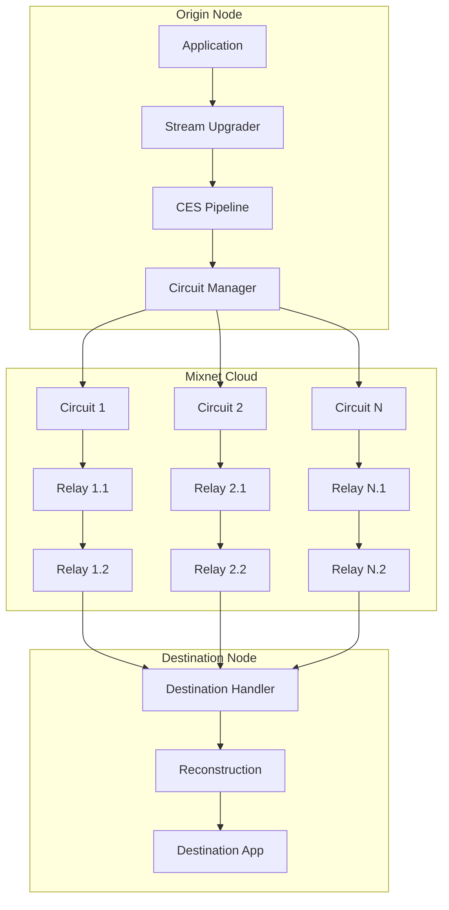

# Lib-Mix: Metadata-Private Communication for libp2p

Lib-Mix is a high-performance, sharded, configurable-hop mixnet protocol for
libp2p that provides metadata-private communication at near-wire speeds.

## Overview

Lib-Mix addresses the fundamental trade-off between privacy and performance in
decentralized applications. By using multi-path sharding and configurable onion
routing, it enables metadata-blind communication without the massive latency
overhead typical of traditional mixnets.

### Key Features

- **Transport Agnostic**: Works over any libp2p transport (QUIC, TCP, WebRTC).
- **Multi-Path Sharding**: Data is split into multiple shards sent over independent circuits, improving throughput and resilience.
- **Configurable Onion Routing**: Support for 1-10 hops, allowing developers to tune the privacy-performance trade-off.
- **Erasure Coding**: Uses Reed-Solomon coding to allow reconstruction even if some shards or circuits fail.
- **Layered Encryption**: Each hop is protected by Noise-based layered encryption.
- **Metadata Privacy**: Relays have no knowledge of the origin, destination, or content of the traffic.

## How the protocol works

The implementation in `mixnet/` follows a repeatable flow for every outbound
message:

1. **Configuration**: `DefaultConfig` or `NewMixnetConfig` defines how many
   hops, circuits, and privacy features are enabled.
2. **Runtime construction**: `NewMixnet` wires together the circuit manager,
   relay discovery, relay handler, CES pipeline, metrics, and resource manager.
3. **Relay discovery**: candidate relays are sampled and filtered so that the
   sender can build circuits without reusing the destination or local peer.
4. **Circuit establishment**: one or more circuits are created, each containing
   `HopCount` relays. The runtime connects to the entry hop for every circuit.
5. **Session setup**: the destination receives or derives session key material
   used to protect the payload end-to-end.
6. **Payload processing**: if CES is enabled, data is compressed, encrypted,
   and sharded. If CES is disabled, the runtime still encrypts the payload and
   evenly splits it across the available circuits.
7. **Privacy wrapping**: every shard is wrapped in privacy metadata, optional
   header padding, and optional authenticity tags before it is sent.
8. **Relay forwarding**: each relay only unwraps the routing information needed
   to identify the next hop and forwards the shard onward.
9. **Destination reconstruction**: the destination collects enough shards to
   meet the reconstruction threshold, verifies tags when enabled, decrypts the
   session payload, and delivers the recovered bytes to the application.

### Session-routing mode

Lib-Mix includes an opt-in setup-once/data-later mode for repeated sends and
stream writes.

- **Legacy mode**: `EnableSessionRouting=false` keeps the existing wire
  protocol. Every write carries routing/setup information again.
- **Routed mode**: `EnableSessionRouting=true` sends one session-setup frame
  per `(baseSessionID, circuitID)` and then smaller session-data frames for
  later header-only writes on that base session.
- **Idle cleanup**: `SessionRouteIdleTimeout` controls when sender, relays, and
  destination discard cached routed-session state if the session goes idle.

This distinction matters most for `MixStream.Write` and repeated
`SendWithSession` calls that reuse the same base session ID. The public API did
not move; the wire behavior under it became more efficient when the flag is on.
Full onion continues to use the legacy per-frame onion path.

### Header-only relay behavior

`EncryptionModeHeaderOnly` now uses a dedicated stream-through relay path.

- The origin sends a single framed message containing `[encrypted header][payload]`.
- Intermediate relays decrypt only the onion header required to identify the
  next hop and rewrite only that header portion.
- The remaining payload bytes are piped directly from the inbound relay stream
  to the outbound stream in fixed-size chunks.
- Intermediate hops do not rebuild a fresh full payload buffer for each hop.
- The destination still buffers/reconstructs normally because it must reassemble
  the end-to-end protected session payload before handing bytes to the
  application.

This is the important implementation detail behind the header-only benchmark
improvement for large payloads: reduced hop crypto and reduced relay-side copy
pressure.

This layered flow is why the codebase is split into `core/config.go`,
`core/upgrader.go`, `core/stream.go`, `core/privacy_transport.go`,
`circuit/`, `relay/`, `discovery/`, and `ces/`.

## Architecture

Lib-Mix operates as a stream upgrader in the libp2p stack.



## Usage

### As an Origin (Sender)

```go
import (
    "time"

    mixnet "github.com/libp2p/go-libp2p/mixnet/core"
)

// Configure the mixnet.
cfg := mixnet.DefaultConfig()
cfg.HopCount = 3
cfg.CircuitCount = 5
cfg.EnableSessionRouting = true
cfg.SessionRouteIdleTimeout = 30 * time.Second

// Initialize the runtime.
m, err := mixnet.NewMixnet(cfg, host, routing)
if err != nil {
    panic(err)
}

// Send a single payload privately.
err = m.Send(ctx, destinationPeerID, []byte("Hello, private world!"))
```

### As a Stream Origin

```go
stream, err := m.OpenStream(ctx, destinationPeerID)
if err != nil {
    panic(err)
}
defer stream.Close()

if _, err := stream.Write([]byte("Hello over MixStream")); err != nil {
    panic(err)
}
```

`OpenStream` is the normal application entry point for long-lived writes. In
legacy mode each `Write` still takes the old per-write route/setup path. In
routed header-only mode the first write establishes session-routing state and
later writes reuse it. Full onion remains on the legacy per-frame path.

### Reusing a session without `OpenStream`

```go
sessionID := "invoice-upload-42"
if err := m.SendWithSession(ctx, destinationPeerID, chunk1, sessionID); err != nil {
    panic(err)
}
if err := m.SendWithSession(ctx, destinationPeerID, chunk2, sessionID); err != nil {
    panic(err)
}
```

`SendWithSession` benefits from session-routing too when the caller reuses the
same base session ID on header-only mode. Full onion keeps the legacy per-send
path.

### As a Destination (Receiver)

```go
// Wait for an inbound mixnet session that was opened by a remote peer.
stream, err := m.AcceptStream(ctx)
if err != nil {
    panic(err)
}
defer stream.Close()

buf := make([]byte, 4096)
n, err := stream.Read(buf)
if err != nil {
    panic(err)
}
```

## Configuration

The `MixnetConfig` allows fine-tuning the protocol:

| Option | Default | Description |
|--------|---------|-------------|
| `HopCount` | 2 | Number of relays in each circuit (1-10) |
| `CircuitCount` | 3 | Number of parallel circuits to establish (1-20) |
| `Compression` | "gzip" | Compression algorithm ("gzip" or "snappy") |
| `UseCESPipeline` | `true` | Enables the CES compress-encrypt-shard pipeline |
| `UseCSE` | `false` | Enables the non-CES compress-shard-encrypt fast path |
| `EncryptionMode` | `"full"` | Per-hop encryption mode (`"full"` or `"header-only"`) |
| `SelectionMode` | "rtt" | Relay selection strategy ("rtt", "random", or "hybrid") |
| `SamplingSize` | `0` (auto) | Relay candidates sampled before selection |
| `RandomnessFactor` | `0.3` | Blend factor for hybrid relay selection |
| `ErasureThreshold` | `0` (auto, ~60%) | Number of shards required to reconstruct data (0 = auto-derive, typically ~60% of circuits) |
| `HeaderPaddingEnabled` | `true` | Adds randomized header padding to reduce size fingerprinting |
| `HeaderPaddingMin/Max` | `16/256` | Header padding range when enabled |
| `PayloadPaddingStrategy` | `"none"` | Payload padding strategy (`"none"`, `"random"`, `"buckets"`) |
| `PayloadPaddingMin/Max` | `0/0` | Random payload padding range |
| `PayloadPaddingBuckets` | `nil` | Bucket sizes used by bucket padding |
| `EnableAuthTag` | `false` | Enables per-shard authenticity tags |
| `AuthTagSize` | `16` | Truncated HMAC tag size when auth tags are enabled |
| `EnableSessionRouting` | `false` | Opt-in setup-once/data-later wire mode for repeated header-only stream writes and reused sessions |
| `SessionRouteIdleTimeout` | `30s` | Idle timeout for cached session-routing state |
| `MaxJitter` | `50` | Adds up to 50 ms of random delay between shard transmissions |

### Why these flags exist

The configuration surface is designed around explicit trade-offs instead of a
single fixed deployment profile:

- **Routing flags** (`HopCount`, `CircuitCount`, `SelectionMode`,
  `SamplingSize`, `RandomnessFactor`) exist to control how much path diversity,
  redundancy, and unpredictability the runtime uses.
- **Payload processing flags** (`Compression`, `UseCESPipeline`,
  `ErasureThreshold`, `EncryptionMode`, `EnableSessionRouting`,
  `SessionRouteIdleTimeout`) exist to balance throughput, recovery behavior,
  and per-hop cryptographic cost.
- **Privacy hardening flags** (`HeaderPaddingEnabled`,
  `PayloadPaddingStrategy`, `EnableAuthTag`, `MaxJitter`) exist to reduce size-
  and timing-based correlation signals that remain even after encryption.

## Security notes for session-routing

The routed-session cache is not global. It is scoped to the relay's inbound
authenticated libp2p stream from the previous hop and keyed by
`baseSessionID`.

- Off-path network attackers cannot inject bytes into that stream.
- The current v1 does not add a relay-verified MAC for routed session-data
  frames, so a malicious adjacent relay could still send forged session-data on
  a known routed session.
- The destination still checks end-to-end session AEAD integrity and optional
  auth tags, so tampered data should be rejected there.
- `EnableAuthTag` improves destination-side tamper detection, but it is not a
  relay-side source-authentication mechanism.

For a detailed explanation of each flag, the available choices, why those
choices exist, and what benefit each one provides, see
[`../PRD/configuration-reference.md`](../PRD/configuration-reference.md).

## Package Structure

- [`package-guide.md`](../package-guide.md): package guide and documentation map for the
  `mixnet/` folder.
- [`project-structure.md`](project-structure.md): file-by-file guide to the
  implementation tree.
- [`ces/`](../../ces/): Compress-Encrypt-Shard pipeline.
- [`circuit/`](../../circuit/): Circuit management and onion routing logic.
- [`discovery/`](../../discovery/): Relay discovery via DHT.
- [`relay/`](../../relay/): Relay node packet handling.

## Documentation map

- [`../PRD/design.md`](../PRD/design.md): end-to-end protocol design and flow.
- [`../PRD/configuration-reference.md`](../PRD/configuration-reference.md):
  configuration defaults, trade-offs, and presets.
- [`circuit-readme.md`](circuit-readme.md): circuit lifecycle details.
- [`relay-readme.md`](relay-readme.md): relay-side forwarding model.
- [`discovery-readme.md`](discovery-readme.md): relay discovery details.
- [`ces-readme.md`](ces-readme.md): data transformation pipeline.

## Public integration entry point

There is no application `main.go` for mixnet itself. Embedding it into a
libp2p application starts with the library package:

1. Import `github.com/libp2p/go-libp2p/mixnet/core` and alias it to `mixnet` if you want the old local name.
2. Build a `MixnetConfig` with `DefaultConfig` or `NewMixnetConfig`.
3. Set hops, circuits, encryption mode, and flags such as
   `EnableSessionRouting`.
4. Construct the runtime with `NewMixnet(cfg, host, routing)`.
5. Use `Send`, `SendWithSession`, `OpenStream`, or `AcceptStream`.

That same `MixnetConfig` is also the customization surface for optional
behavior such as CES, encryption mode, relay selection, padding, auth tags,
jitter, and routed-session reuse timeouts.

You can either set fields directly or use the setter helpers on
`MixnetConfig`, such as `SetUseCESPipeline`, `SetUseCSE`,
`SetEncryptionMode`, `SetHeaderPadding`, `SetPayloadPaddingStrategy`,
`SetPayloadPaddingRange`, `SetPayloadPaddingBuckets`, `SetAuthTag`,
`SetSamplingSize`, `SetRandomnessFactor`, `SetEnableSessionRouting`, and
`SetSessionRouteIdleTimeout`. If you start from `NewMixnetConfig`, call
`InitDefaults` before validating if you want unset fields filled in later.

`DefaultConfig` is the ready-to-use path. `NewMixnetConfig` is the manual path:
it intentionally clears most fields back to zero values so you can specify
everything yourself before calling `Validate`. Once circuits are established,
the runtime locks the config; setters then return `ErrConfigImmutable`. The
derived getters `GetErasureThreshold` and `GetSamplingSize` expose the
effective values after defaults are applied.

### Advanced exported entry points

Beyond `NewMixnet`, the package also exposes:

- `DefaultRetryConfig` and `RetryWithBackoff` for retry policies around transient failures
- `NewStreamUpgrader` for callers that want a dedicated stream-upgrade facade
- `NewMixnetWithKeyManagement` for retry, graceful close, and key-manager access
- `NewMixnetWithResources` plus `DefaultResourceConfig` for relay resource limits
- `DiscoverRelaysWithVerification` and `UseDiscoveryService` for lower-level relay discovery control
- `DefaultCoverTrafficConfig` and `NewCoverTrafficGenerator` for optional cover traffic
- `ProtocolID` for manual handler wiring or peer capability checks
- `Metrics`, `MetricsHandler`, and `StartMetricsEndpoint` for observability

Two environment variables are also worth knowing about when integrating:

- `MIXNET_STREAM_TIMEOUT` overrides the default stream timeout used by the runtime
- `LIBP2P_MIXNET_METRICS_ADDR` starts the metrics endpoint automatically at process startup if set

The only `main.go` under `mixnet/` is the benchmark command in
`mixnet/benchmarks/cmd/mixnet-bench/`.

## License

Lib-Mix is part of `go-libp2p` and is licensed under the same terms.
